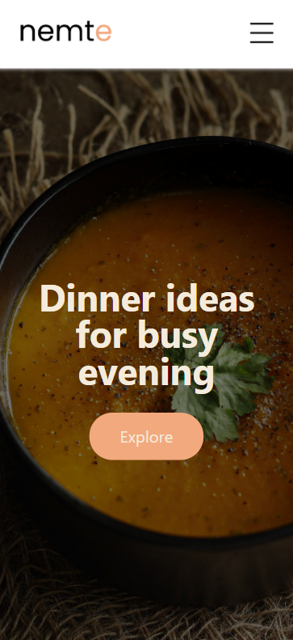
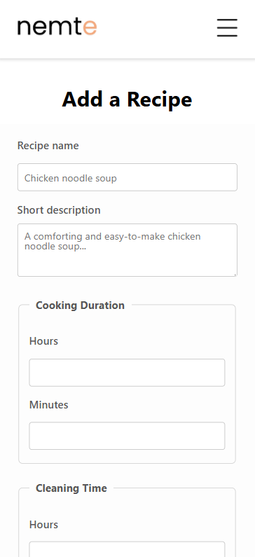

# Nemte Frontend (React + Vite)

## Introduction

Nemte is a recipe website that currently allows anyone to browse, create and edit recipes.

This is a final mobile-first Code Academy Front-End course project.

This repository contains the frontend part of the project, built with **React** and **Vite**.  

The frontend connects to a separate **Node.js + MongoDB backend** project - https://github.com/sarolyte/nemte-backend. Both must be running at the same time for the application to function properly.

---

## Getting Started

Follow these steps to get the frontend running on your local system.

### 1. Installation Process

1. Download or clone this repository to your computer.
2. Open the project in Visual Studio Code or your preferred editor.
3. Open a terminal in the project folder and run the command:
npm install

This will install all the required dependencies.

### 2. Software dependencies

React 19.1.1

Vite 7.1.7

React Router DOM 6.30.1

React Icons 5.5.0

React Select 5.10.2

React Responsive 10.0.1

normalize.css 8.0.1

You will need Node.js version 18 or higher installed on your system.

---

## Build

1. Make sure the backend project is running (https://github.com/sarolyte/nemte-backend).
2. In the terminal, run the command:
npm run dev
3. This will start the frontend development server.
4. You can then open the app in your browser, usually at http://localhost:5173

---

 

